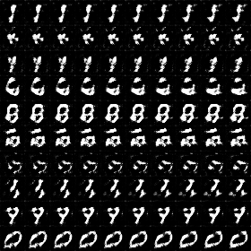
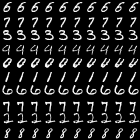
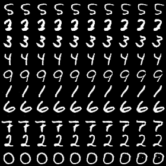

# InfoGAN - Pytorch Lightning
Kookmin University Visual Computing Lab Study, PyTorch-Lightning implementation of [InfoGAN: Interpretable Representation Learning by Information Maximizing Generative Adversarial Nets](https://arxiv.org/abs/1606.03657) with result of experiments on MNIST.

## File Structure
```
├── data
│   └── mnist                           # mnist data (not included in this repo)
├── checkpoints
│   └── weight.ckpt                     # free naming weight.ckpt (not included in this repo)
├── results
│   └── demo & results_by_epoch        
├── train.py                            # train script
├── train.py                            # train script
├── config.yaml                         # config settings for training 
├── utils.py                            # utils
├── dataset.py                          # dataset module
├── model.py                            # Infogan Generator, Discriminator, Qrator module
└── test.py                             # generation results to be saved here

```

## Development Environment

```
- NVIDIA GeForce GTX 1060Ti
- cuda 11.5
- python 3.10.4
- pytorch 1.11.0     ( py3.10_cuda11.3_cudnn8_0    pytorch )
- pytorch-lightning  0.8.5                
```

## Usage
### Train
Edit `config.yaml `to change training setting and run `train.py`
```
cd infogan
python train.py 
```
### Test
Run test.py, you can experience gradio infogan demo
```
cd infogan
python test.py 
```

## Results
### Training Loss Curve


### Results by epoch

<table align='center'>
<tr align='center'>
<th> Epoch 1 </th>
<th> Epoch 20 </th>
<th> Epoch 50 </th>
</tr>
<tr>
<td>
<td>
<td>
</tr>
</table>


### Demo ( Gradio )
You can manipulate latent code ( one discrete code -label, two continuous codes - rotation & width )
<p align="center"></p>


## References
https://arxiv.org/abs/1606.03657    
https://github.com/Natsu6767/InfoGAN-PyTorch    
https://github.com/Yangyangii/GAN-Tutorial/blob/master/MNIST/infoGAN.ipynb    
